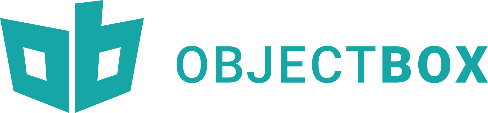

<picture></picture>

# ObjectBox Gradle Plugin
                            
The ObjectBox Gradle Plugin makes using ObjectBox easy in a JVM or Android project written in Java or Kotlin, 
and is free and open source. See the [documentation on how to get started](https://docs.objectbox.io/getting-started).

The plugin

- automatically adds a dependency on [the Java SDK](https://github.com/objectbox/objectbox-java) and if needed the
  [Kotlin extension functions](https://docs.objectbox.io/kotlin-support) library,
- automatically adds runtime libraries for Android and the developer machine,
- adds and configures the annotation processor to generate the model JSON file and source code like the `MyObjectBox`
  and underscore classes (like `Example_`) used for [queries](https://docs.objectbox.io/queries),
- for Android and Java JVM projects, registers a byte code transformer to 
  [make relations easier to use](https://docs.objectbox.io/relations#initialization-magic)

## Minimum requirements to apply the plugin

- Gradle `7.0` (see [GradleCompat](objectbox-gradle-plugin/src/main/kotlin/io/objectbox/gradle/util/GradleCompat.kt))
- Android Plugin `4.1` (see [AndroidCompat](objectbox-gradle-plugin/src/main/kotlin/io/objectbox/gradle/util/AndroidCompat.kt))
- JDK 8

## Development

This project is known to build with JDK 17.

This repository contains a collection of Gradle subprojects:
- `objectbox-gradle-plugin` provides the actual Gradle plugins (`io.objectbox` and `io.objectbox.sync`),
- `objectbox-processor` provides an annotation processor,
- `objectbox-generator` provides a source code generator used by the annotation processor,
- `objectbox-code-modifier` provides model file ("IdSync") generation used by the annotation processor,
  and byte-code transformers for Android and Java projects.
  - Multiple `agp-wrapper-x-y` projects provide a compatibility layer for specific versions
    of the Android Plugin API, currently for byte-code transforms only.

All are published as Maven artifacts (see `gradle` folder).
                                                
### Adding a new property type

This is a checklist on how to add support for a new property type:

-  (Optional) Java: update generated Flatbuffers Java classes to add new `PropertyType`.
-  Generator: add new generator `PropertyType` and map it to the Java API `PropertyType`.
-  Processor: add a field with each new supported type to `SimpleEntity.java` (`SimpleEntityTest`).
-  Processor: update to detect the new property types (also check if indexes should be prevented).
  - Update the model expected by the test.
-  Java API: add new collect methods to `Cursor.java`.
-  Generator: update `PropertyCollector` to generate code using the new collect methods.
  - Update the generated files expected by the test.
- Java integration tests: add a field with the new type to `TestEntity.java`, update `BoxTest.java`.
  - Java: update `TestEntity` and tests with code (incl. generated by the plugin) of integration tests.
- Java: add additional tests as needed, e.g. query the new property.
                     
## License

    ObjectBox Build Tools
    Copyright (C) 2017-2025 ObjectBox Ltd.
    
    This program is free software: you can redistribute it and/or modify
    it under the terms of the GNU Affero General Public License as published
    by the Free Software Foundation, either version 3 of the License, or
    (at your option) any later version.
    
    This program is distributed in the hope that it will be useful,
    but WITHOUT ANY WARRANTY; without even the implied warranty of
    MERCHANTABILITY or FITNESS FOR A PARTICULAR PURPOSE.  See the
    GNU Affero General Public License for more details.
    
    You should have received a copy of the GNU Affero General Public License
    along with this program.  If not, see <https://www.gnu.org/licenses/>.

Note that this license applies to the code in this repository only.
The build tools in this repository are not distributed with your application.
So their copyleft license has no impact on how you distribute your application.
See our website on details about all [licenses for ObjectBox components](https://objectbox.io/faq/#license-pricing).
